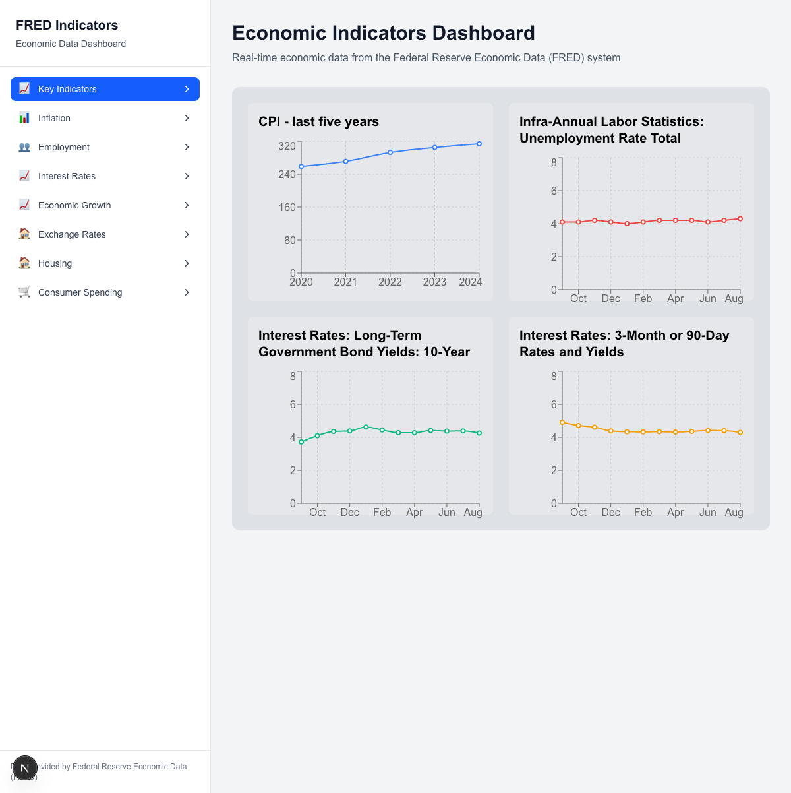

# FRED Economic Indicators Dashboard

A Next.js dashboard application that displays real-time economic indicators from the Federal Reserve Economic Data (FRED) system, built from a Figma design mockup.

## 📊 Dashboard Screenshot



## 🚀 Original Development Prompt

This application was generated using Claude Code with the following prompt:

> Using the following figma mockup (<https://www.figma.com/design/hYKzbi8mANAHpohCJg5fWj/key-indicators?m=auto&t=1E37ZIqNNuDhSuPY-6>) use the figma dev MCP server to analyze the mockup and build the underlying code in this next.js application. Use the recharts library for creating charts to make this a web application. Check how this application looks using the playwright MCP server and verify it looks as close to the mock as possible.

Additional request: "populate these charts with real-world data from FRED"

## 🏗️ Features

- **📈 Real-time Economic Data**: Integrates with FRED API to display live economic indicators
- **🎨 Figma Design Implementation**: Built to match the original Figma mockup design
- **📊 Interactive Charts**: Uses Recharts library for responsive, interactive visualizations
- **🔄 Data Caching**: SWR for efficient data fetching and caching
- **📱 Responsive Layout**: Sidebar navigation with main content area

## 📈 Economic Indicators Displayed

1. **CPI (Consumer Price Index)** - Last 5 years annual data
2. **Unemployment Rate** - Monthly labor statistics
3. **10-Year Treasury Bonds** - Long-term government bond yields
4. **3-Month Treasury Bills** - Short-term interest rates

## 🛠️ Tech Stack

- **Next.js 15.5.2** - React framework with App Router
- **React 19.1.0** - UI library
- **TypeScript** - Type safety
- **Tailwind CSS 4** - Styling
- **Recharts** - Chart visualizations
- **SWR** - Data fetching and caching
- **date-fns** - Date manipulation

## 🚀 Getting Started

1. **Install dependencies:**

```bash
npm install
```

2. **Set up environment variables:**

Create a `.env.local` file with your FRED API key:

```bash
NEXT_PUBLIC_FRED_API_KEY=your_fred_api_key_here
```

3. **Run the development server:**

```bash
npm run dev
```

4. **Open your browser:**

Visit [http://localhost:3000](http://localhost:3000) to see the dashboard.

## 🏛️ FRED API Integration

The application uses the Federal Reserve Economic Data (FRED) API to fetch real economic indicators:

- **API Endpoints**: Custom Next.js API routes in `/app/api/fred/`
- **Data Processing**: Server-side data fetching with proper error handling
- **Caching**: SWR handles client-side caching and revalidation

### API Routes

- `/api/fred/cpi` - Consumer Price Index data
- `/api/fred/unemployment` - Unemployment rate data  
- `/api/fred/treasury-10year` - 10-year treasury bond yields
- `/api/fred/treasury-3month` - 3-month treasury bill rates

## 🎨 Design Process

1. **Figma Analysis**: Used Figma MCP server to analyze the design mockup
2. **Component Structure**: Extracted layout specifications and component hierarchy
3. **Implementation**: Built React components to match the design
4. **Data Integration**: Connected real FRED data to replace mock data
5. **Testing**: Verified accuracy using Playwright browser automation

## 📦 Project Structure

```text
app/
├── api/fred/           # FRED API endpoints
├── globals.css         # Global styles
├── layout.tsx         # Root layout
└── page.tsx           # Main dashboard page
lib/
└── fred-api.ts        # FRED API client utilities
```

## 🔧 Available Scripts

- `npm run dev` - Start development server
- `npm run build` - Build for production
- `npm run start` - Start production server  
- `npm run lint` - Run ESLint

## 📝 Environment Requirements

- Node.js 18+
- FRED API Key (free from [Federal Reserve Economic Data](https://fred.stlouisfed.org/docs/api/api_key.html))
