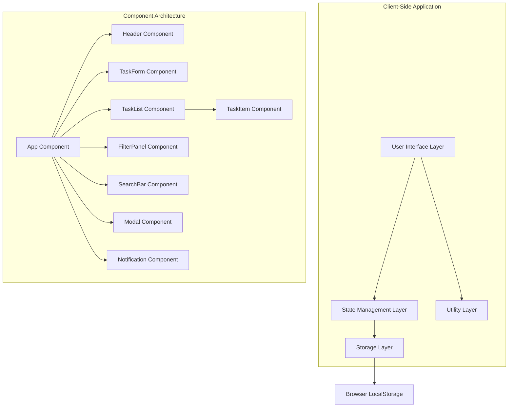
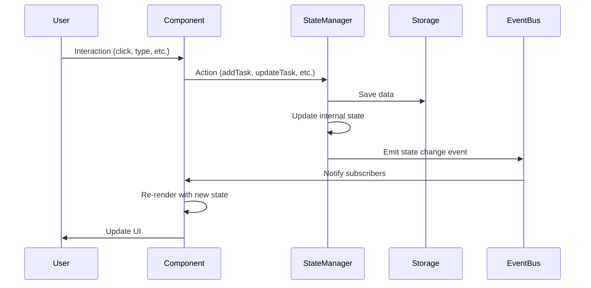

# Design: Todo List MVP

## 1. System Architecture Overview

### 1.1 High-Level Architecture



### 1.2 Technology Stack

- **Frontend**: HTML5, CSS3, Vanilla JavaScript (ES6+)
- **Storage**: Browser LocalStorage API
- **Architecture**: Component-based with event-driven communication
- **Styling**: CSS Grid, Flexbox, BEM methodology, CSS Custom Properties
- **Build Process**: None initially (pure HTML/CSS/JS)

### 1.3 Browser Support

- Chrome 90+, Firefox 88+, Safari 14+, Edge 90+
- Progressive enhancement for older browsers
- Mobile-responsive design for all screen sizes

## 2. Data Models and Storage

### 2.1 Task Data Model

```javascript
interface Task {
  id: string;              // UUID v4 format
  title: string;           // Task description (1-500 characters)
  completed: boolean;      // Completion status
  createdAt: Date;         // Creation timestamp
  updatedAt: Date;         // Last modification timestamp
  priority: 'low' | 'medium' | 'high'; // Task priority level
  category: string;        // Optional category (future enhancement)
  tags: string[];          // Optional tags array (future enhancement)
}
```

### 2.2 Application State Model

```javascript
interface AppState {
  tasks: Task[];
  filters: {
    status: 'all' | 'active' | 'completed';
    priority: 'all' | 'low' | 'medium' | 'high';
    searchQuery: string;
  };
  ui: {
    theme: 'light' | 'dark';
    sidebarOpen: boolean;
    modalOpen: boolean;
    notification: {
      message: string;
      type: 'success' | 'error' | 'info';
      visible: boolean;
    };
  };
  settings: {
    maxTasks: number;
    autoSave: boolean;
    confirmDeletion: boolean;
  };
}
```

### 2.3 Storage Architecture

```javascript
// LocalStorage keys
const STORAGE_KEYS = {
  TASKS: 'todoapp_tasks',
  SETTINGS: 'todoapp_settings',
  UI_STATE: 'todoapp_ui_state'
};

// Storage service interface
interface StorageService {
  saveTasks(tasks: Task[]): void;
  loadTasks(): Task[];
  saveSettings(settings: object): void;
  loadSettings(): object;
  saveUIState(state: object): void;
  loadUIState(): object;
  clearAll(): void;
}
```

## 3. Component Architecture

### 3.1 Component Hierarchy

```
App
├── Header
│   ├── Logo
│   ├── ThemeToggle
│   └── SettingsButton
├── Main
│   ├── TaskForm
│   │   ├── TaskInput
│   │   ├── PrioritySelector
│   │   └── SubmitButton
│   ├── FilterPanel
│   │   ├── StatusFilter
│   │   ├── PriorityFilter
│   │   └── SearchBar
│   └── TaskList
│       └── TaskItem[]
│           ├── TaskCheckbox
│           ├── TaskContent
│           ├── TaskMeta
│           └── TaskActions
├── Modal
│   ├── ModalHeader
│   ├── ModalBody
│   └── ModalFooter
└── Notification
    ├── NotificationIcon
    ├── NotificationMessage
    └── NotificationClose
```

### 3.2 Component Specifications

#### 3.2.1 App Component
```javascript
class App {
  constructor() {
    this.state = new StateManager();
    this.storage = new StorageService();
    this.components = new Map();
  }

  // Public API
  init(): void;
  render(): void;
  destroy(): void;
  
  // Event handlers
  handleStateChange(newState: AppState): void;
  handleTaskCreate(taskData: Partial<Task>): void;
  handleTaskUpdate(taskId: string, updates: Partial<Task>): void;
  handleTaskDelete(taskId: string): void;
}
```

#### 3.2.2 TaskItem Component
```javascript
class TaskItem {
  constructor(task: Task, options: TaskItemOptions) {
    this.task = task;
    this.options = options;
    this.element = null;
  }

  // Public API
  render(): HTMLElement;
  update(task: Task): void;
  setEditMode(enabled: boolean): void;
  destroy(): void;
  
  // Event emission
  onComplete(callback: Function): void;
  onEdit(callback: Function): void;
  onDelete(callback: Function): void;
}
```

#### 3.2.3 TaskForm Component
```javascript
class TaskForm {
  constructor(options: TaskFormOptions) {
    this.options = options;
    this.element = null;
    this.validators = new Map();
  }

  // Public API
  render(): HTMLElement;
  reset(): void;
  validate(): boolean;
  getFormData(): Partial<Task>;
  
  // Event emission
  onSubmit(callback: Function): void;
  onCancel(callback: Function): void;
}
```

### 3.3 Component Communication

#### 3.3.1 Event System
```javascript
// Custom event constants
const EVENTS = {
  TASK_CREATED: 'task:created',
  TASK_UPDATED: 'task:updated',
  TASK_DELETED: 'task:deleted',
  TASK_COMPLETED: 'task:completed',
  FILTER_CHANGED: 'filter:changed',
  SEARCH_QUERY_CHANGED: 'search:query-changed',
  THEME_CHANGED: 'theme:changed',
  MODAL_OPEN: 'modal:open',
  MODAL_CLOSE: 'modal:close',
  NOTIFICATION_SHOW: 'notification:show',
  NOTIFICATION_HIDE: 'notification:hide'
};

// EventBus for component communication
class EventBus {
  subscribe(event: string, callback: Function): void;
  unsubscribe(event: string, callback: Function): void;
  emit(event: string, data?: any): void;
}
```

## 4. State Management

### 4.1 State Manager Architecture

```javascript
class StateManager {
  constructor() {
    this.state = this.getInitialState();
    this.subscribers = new Set();
    this.middleware = [];
  }

  // State manipulation
  getState(): AppState;
  setState(updates: Partial<AppState>): void;
  
  // Task operations
  addTask(task: Partial<Task>): void;
  updateTask(taskId: string, updates: Partial<Task>): void;
  deleteTask(taskId: string): void;
  toggleTaskComplete(taskId: string): void;
  
  // Filter operations
  setFilter(filterType: string, value: any): void;
  clearFilters(): void;
  
  // UI operations
  setTheme(theme: 'light' | 'dark'): void;
  showNotification(message: string, type: string): void;
  hideNotification(): void;
  
  // Subscription management
  subscribe(callback: Function): Function;
  unsubscribe(callback: Function): void;
}
```

### 4.2 Data Flow Diagram



## 5. User Interface Design

### 5.1 Layout Structure

```css
/* Main application layout */
.app {
  display: grid;
  grid-template-areas: 
    "header header"
    "sidebar main"
    "footer footer";
  grid-template-rows: auto 1fr auto;
  grid-template-columns: 250px 1fr;
  min-height: 100vh;
}

.app__header { grid-area: header; }
.app__sidebar { grid-area: sidebar; }
.app__main { grid-area: main; }
.app__footer { grid-area: footer; }

/* Responsive breakpoints */
@media (max-width: 768px) {
  .app {
    grid-template-areas:
      "header"
      "main"
      "footer";
    grid-template-columns: 1fr;
  }
  
  .app__sidebar {
    position: fixed;
    transform: translateX(-100%);
    transition: transform 0.3s ease;
  }
  
  .app__sidebar--open {
    transform: translateX(0);
  }
}
```

### 5.2 Component Styling Architecture

#### 5.2.1 CSS Custom Properties
```css
:root {
  /* Colors */
  --color-primary: #007bff;
  --color-primary-dark: #0056b3;
  --color-secondary: #6c757d;
  --color-success: #28a745;
  --color-danger: #dc3545;
  --color-warning: #ffc107;
  --color-info: #17a2b8;
  
  /* Background colors */
  --bg-primary: #ffffff;
  --bg-secondary: #f8f9fa;
  --bg-tertiary: #e9ecef;
  
  /* Text colors */
  --text-primary: #212529;
  --text-secondary: #6c757d;
  --text-muted: #adb5bd;
  
  /* Spacing */
  --spacing-xs: 0.25rem;
  --spacing-sm: 0.5rem;
  --spacing-md: 1rem;
  --spacing-lg: 1.5rem;
  --spacing-xl: 3rem;
  
  /* Typography */
  --font-family-base: system-ui, -apple-system, sans-serif;
  --font-size-base: 1rem;
  --font-size-sm: 0.875rem;
  --font-size-lg: 1.125rem;
  --line-height-base: 1.5;
  
  /* Borders */
  --border-radius-sm: 0.125rem;
  --border-radius-md: 0.25rem;
  --border-radius-lg: 0.5rem;
  --border-width: 1px;
  --border-color: #dee2e6;
  
  /* Shadows */
  --shadow-sm: 0 0.125rem 0.25rem rgba(0, 0, 0, 0.075);
  --shadow-md: 0 0.5rem 1rem rgba(0, 0, 0, 0.15);
  --shadow-lg: 0 1rem 3rem rgba(0, 0, 0, 0.175);
  
  /* Transitions */
  --transition-fast: 0.15s ease-in-out;
  --transition-base: 0.3s ease-in-out;
  --transition-slow: 0.5s ease-in-out;
  
  /* Z-index scale */
  --z-index-dropdown: 1000;
  --z-index-modal: 1050;
  --z-index-notification: 1060;
}

/* Dark theme overrides */
[data-theme="dark"] {
  --bg-primary: #212529;
  --bg-secondary: #343a40;
  --bg-tertiary: #495057;
  --text-primary: #f8f9fa;
  --text-secondary: #adb5bd;
  --text-muted: #6c757d;
  --border-color: #495057;
}
```

#### 5.2.2 BEM Component Example
```css
/* TaskItem component styles */
.task-item {
  display: flex;
  align-items: center;
  padding: var(--spacing-md);
  border: var(--border-width) solid var(--border-color);
  border-radius: var(--border-radius-md);
  background-color: var(--bg-primary);
  transition: var(--transition-fast);
  margin-bottom: var(--spacing-sm);
}

.task-item:hover {
  box-shadow: var(--shadow-sm);
  border-color: var(--color-primary);
}

.task-item__checkbox {
  margin-right: var(--spacing-md);
  cursor: pointer;
}

.task-item__content {
  flex: 1;
  min-width: 0;
}

.task-item__title {
  font-size: var(--font-size-base);
  font-weight: 500;
  color: var(--text-primary);
  margin: 0;
  word-wrap: break-word;
}

.task-item__meta {
  display: flex;
  align-items: center;
  gap: var(--spacing-sm);
  margin-top: var(--spacing-xs);
  font-size: var(--font-size-sm);
  color: var(--text-secondary);
}

.task-item__actions {
  display: flex;
  gap: var(--spacing-xs);
  opacity: 0;
  transition: opacity var(--transition-fast);
}

.task-item:hover .task-item__actions {
  opacity: 1;
}

.task-item--completed .task-item__title {
  text-decoration: line-through;
  color: var(--text-muted);
}

.task-item--high-priority {
  border-left: 4px solid var(--color-danger);
}

.task-item--medium-priority {
  border-left: 4px solid var(--color-warning);
}

.task-item--low-priority {
  border-left: 4px solid var(--color-info);
}
```

### 5.3 Responsive Design Strategy

#### 5.3.1 Breakpoint System
```css
/* Mobile-first breakpoints */
:root {
  --breakpoint-sm: 576px;  /* Small devices (phones) */
  --breakpoint-md: 768px;  /* Medium devices (tablets) */
  --breakpoint-lg: 992px;  /* Large devices (laptops) */
  --breakpoint-xl: 1200px; /* Extra large devices (desktops) */
}

/* Responsive mixins (implemented as CSS) */
@media (min-width: 576px) {
  .container { max-width: 540px; }
}

@media (min-width: 768px) {
  .container { max-width: 720px; }
}

@media (min-width: 992px) {
  .container { max-width: 960px; }
}

@media (min-width: 1200px) {
  .container { max-width: 1140px; }
}
```

## 6. API Design and Interfaces

### 6.1 Storage Service API

```javascript
interface StorageService {
  // Task operations
  saveTasks(tasks: Task[]): Promise<void>;
  loadTasks(): Promise<Task[]>;
  
  // Settings operations
  saveSettings(settings: AppSettings): Promise<void>;
  loadSettings(): Promise<AppSettings>;
  
  // Backup and restore
  exportData(): Promise<string>;
  importData(data: string): Promise<void>;
  clearAllData(): Promise<void>;
  
  // Storage utilities
  getStorageInfo(): StorageInfo;
  isStorageAvailable(): boolean;
}

interface StorageInfo {
  used: number;      // Bytes used
  total: number;     // Total available bytes
  percentage: number; // Usage percentage
}
```

### 6.2 Task Manager API

```javascript
interface TaskManager {
  // CRUD operations
  createTask(taskData: CreateTaskData): Promise<Task>;
  updateTask(taskId: string, updates: UpdateTaskData): Promise<Task>;
  deleteTask(taskId: string): Promise<void>;
  getTask(taskId: string): Promise<Task | null>;
  getAllTasks(): Promise<Task[]>;
  
  // Bulk operations
  createMultipleTasks(tasksData: CreateTaskData[]): Promise<Task[]>;
  updateMultipleTasks(updates: Array<{id: string, data: UpdateTaskData}>): Promise<Task[]>;
  deleteMultipleTasks(taskIds: string[]): Promise<void>;
  
  // Search and filter
  searchTasks(query: string): Promise<Task[]>;
  filterTasks(filters: TaskFilters): Promise<Task[]>;
  sortTasks(tasks: Task[], sortBy: SortCriteria): Task[];
  
  // Statistics
  getTaskStats(): Promise<TaskStatistics>;
}

interface CreateTaskData {
  title: string;
  priority?: TaskPriority;
  category?: string;
  tags?: string[];
}

interface UpdateTaskData {
  title?: string;
  completed?: boolean;
  priority?: TaskPriority;
  category?: string;
  tags?: string[];
}

interface TaskFilters {
  status?: 'all' | 'active' | 'completed';
  priority?: TaskPriority | 'all';
  category?: string | 'all';
  tags?: string[];
  dateRange?: {
    start: Date;
    end: Date;
  };
}

interface TaskStatistics {
  total: number;
  completed: number;
  active: number;
  byPriority: Record<TaskPriority, number>;
  byCategory: Record<string, number>;
}
```

### 6.3 Component Communication API

```javascript
interface ComponentAPI {
  // Lifecycle methods
  init(container: HTMLElement, options?: ComponentOptions): void;
  render(): HTMLElement;
  update(data?: any): void;
  destroy(): void;
  
  // Event handling
  on(event: string, callback: EventCallback): void;
  off(event: string, callback: EventCallback): void;
  emit(event: string, data?: any): void;
  
  // State management
  setState(updates: Partial<ComponentState>): void;
  getState(): ComponentState;
  
  // DOM utilities
  find(selector: string): HTMLElement | null;
  findAll(selector: string): HTMLElement[];
}

interface ComponentOptions {
  theme?: 'light' | 'dark';
  responsive?: boolean;
  accessibility?: boolean;
  [key: string]: any;
}

type EventCallback = (event: CustomEvent) => void;
```

## 7. Security and Performance Considerations

### 7.1 Security Measures

#### 7.1.1 Input Validation
```javascript
class TaskValidator {
  static validateTitle(title: string): ValidationResult {
    const errors = [];
    
    if (!title || typeof title !== 'string') {
      errors.push('Title is required and must be a string');
    }
    
    if (title.length > 500) {
      errors.push('Title must be less than 500 characters');
    }
    
    if (title.trim().length === 0) {
      errors.push('Title cannot be empty');
    }
    
    // XSS prevention
    const sanitized = this.sanitizeHtml(title);
    
    return {
      isValid: errors.length === 0,
      errors,
      sanitizedValue: sanitized
    };
  }
  
  static sanitizeHtml(input: string): string {
    const div = document.createElement('div');
    div.textContent = input;
    return div.innerHTML;
  }
}
```

#### 7.1.2 Content Security Policy
```html
<meta http-equiv="Content-Security-Policy" 
      content="default-src 'self'; 
               script-src 'self' 'unsafe-inline'; 
               style-src 'self' 'unsafe-inline'; 
               img-src 'self' data:; 
               font-src 'self';">
```

### 7.2 Performance Optimizations

#### 7.2.1 Virtual Scrolling for Large Lists
```javascript
class VirtualScrollList {
  constructor(container, itemHeight, renderItem) {
    this.container = container;
    this.itemHeight = itemHeight;
    this.renderItem = renderItem;
    this.visibleItems = [];
    this.scrollTop = 0;
  }
  
  update(items) {
    this.items = items;
    this.totalHeight = items.length * this.itemHeight;
    this.visibleRange = this.calculateVisibleRange();
    this.render();
  }
  
  calculateVisibleRange() {
    const containerHeight = this.container.clientHeight;
    const startIndex = Math.floor(this.scrollTop / this.itemHeight);
    const endIndex = Math.min(
      startIndex + Math.ceil(containerHeight / this.itemHeight) + 1,
      this.items.length
    );
    
    return { startIndex, endIndex };
  }
}
```

#### 7.2.2 Debounced Search
```javascript
class SearchHandler {
  constructor(searchCallback, delay = 300) {
    this.searchCallback = searchCallback;
    this.delay = delay;
    this.timeoutId = null;
  }
  
  handleInput(query) {
    clearTimeout(this.timeoutId);
    this.timeoutId = setTimeout(() => {
      this.searchCallback(query);
    }, this.delay);
  }
}
```

#### 7.2.3 Lazy Loading and Code Splitting
```javascript
// Dynamic import for advanced features
async function loadAdvancedFeatures() {
  try {
    const { AdvancedTaskManager } = await import('./modules/advanced-task-manager.js');
    return new AdvancedTaskManager();
  } catch (error) {
    console.error('Failed to load advanced features:', error);
    return null;
  }
}
```

## 8. Accessibility Implementation

### 8.1 ARIA Labels and Roles

```html
<!-- Task item with full accessibility -->
<div class="task-item" 
     role="listitem" 
     aria-labelledby="task-title-123" 
     aria-describedby="task-meta-123">
  
  <input type="checkbox" 
         id="task-checkbox-123"
         class="task-item__checkbox"
         aria-label="Mark task as complete"
         aria-describedby="task-title-123">
  
  <div class="task-item__content">
    <h3 id="task-title-123" class="task-item__title">
      Buy groceries for dinner
    </h3>
    <div id="task-meta-123" class="task-item__meta">
      <span aria-label="Priority">High priority</span>
      <span aria-label="Created">Created 2 hours ago</span>
    </div>
  </div>
  
  <div class="task-item__actions" role="group" aria-label="Task actions">
    <button type="button" 
            class="btn btn--icon" 
            aria-label="Edit task"
            data-task-id="123">
      <svg aria-hidden="true">...</svg>
    </button>
    <button type="button" 
            class="btn btn--icon btn--danger" 
            aria-label="Delete task"
            data-task-id="123">
      <svg aria-hidden="true">...</svg>
    </button>
  </div>
</div>
```

### 8.2 Keyboard Navigation

```javascript
class KeyboardNavigation {
  constructor(container) {
    this.container = container;
    this.focusableElements = [];
    this.currentIndex = -1;
    this.init();
  }
  
  init() {
    this.container.addEventListener('keydown', this.handleKeyDown.bind(this));
    this.updateFocusableElements();
  }
  
  handleKeyDown(event) {
    switch (event.key) {
      case 'Tab':
        // Handle tab navigation
        break;
      case 'ArrowUp':
        event.preventDefault();
        this.focusPrevious();
        break;
      case 'ArrowDown':
        event.preventDefault();
        this.focusNext();
        break;
      case 'Enter':
      case ' ':
        event.preventDefault();
        this.activateCurrentElement();
        break;
      case 'Escape':
        this.handleEscape();
        break;
    }
  }
}
```

## 9. Testing Strategy

### 9.1 Testing Architecture

```javascript
// Simple testing framework for critical functionality
class TestSuite {
  constructor(name) {
    this.name = name;
    this.tests = [];
    this.results = {
      passed: 0,
      failed: 0,
      errors: []
    };
  }
  
  test(description, testFunction) {
    this.tests.push({ description, testFunction });
  }
  
  async run() {
    console.log(`Running ${this.name} test suite...`);
    
    for (const test of this.tests) {
      try {
        await test.testFunction();
        this.results.passed++;
        console.log(`✓ ${test.description}`);
      } catch (error) {
        this.results.failed++;
        this.results.errors.push({
          test: test.description,
          error: error.message
        });
        console.error(`✗ ${test.description}: ${error.message}`);
      }
    }
    
    return this.results;
  }
}

// Example task manager tests
const taskManagerTests = new TestSuite('TaskManager');

taskManagerTests.test('should create a new task', async () => {
  const taskManager = new TaskManager();
  const task = await taskManager.createTask({
    title: 'Test task'
  });
  
  assert(task.id, 'Task should have an ID');
  assert(task.title === 'Test task', 'Task title should match input');
  assert(task.completed === false, 'New task should not be completed');
});
```

### 9.2 Integration Testing

```javascript
// Component integration tests
class IntegrationTestSuite {
  constructor() {
    this.dom = new JSDOM();
    this.window = this.dom.window;
    this.document = this.window.document;
  }
  
  async testTaskCreationFlow() {
    // Set up DOM
    document.body.innerHTML = `
      <div id="app">
        <form id="task-form">
          <input id="task-input" type="text">
          <button id="submit-btn" type="submit">Add Task</button>
        </form>
        <div id="task-list"></div>
      </div>
    `;
    
    // Initialize app
    const app = new App();
    await app.init();
    
    // Simulate user interaction
    const input = document.getElementById('task-input');
    const form = document.getElementById('task-form');
    
    input.value = 'Integration test task';
    form.dispatchEvent(new Event('submit'));
    
    // Verify result
    await this.waitFor(() => {
      return document.querySelector('.task-item');
    });
    
    const taskItem = document.querySelector('.task-item');
    assert(taskItem, 'Task item should be created');
    
    const taskTitle = taskItem.querySelector('.task-item__title');
    assert(taskTitle.textContent === 'Integration test task', 'Task title should match');
  }
}
```

## 10. Deployment and Build Configuration

### 10.1 Development Environment

```javascript
// Development server configuration (optional)
const config = {
  development: {
    server: {
      port: 3000,
      host: 'localhost',
      livereload: true
    },
    build: {
      sourcemaps: true,
      minify: false,
      watch: true
    }
  },
  production: {
    build: {
      sourcemaps: false,
      minify: true,
      optimize: true
    }
  }
};
```

### 10.2 Progressive Web App Configuration

```json
// manifest.json
{
  "name": "Todo List MVP",
  "short_name": "TodoMVP",
  "description": "A simple and efficient task management application",
  "start_url": "/",
  "display": "standalone",
  "theme_color": "#007bff",
  "background_color": "#ffffff",
  "icons": [
    {
      "src": "assets/icons/icon-192.png",
      "sizes": "192x192",
      "type": "image/png"
    },
    {
      "src": "assets/icons/icon-512.png",
      "sizes": "512x512",
      "type": "image/png"
    }
  ]
}
```

## 11. Future Enhancement Architecture

### 11.1 Extensibility Points

```javascript
// Plugin system for future enhancements
class PluginManager {
  constructor() {
    this.plugins = new Map();
    this.hooks = new Map();
  }
  
  registerPlugin(name, plugin) {
    this.plugins.set(name, plugin);
    if (plugin.hooks) {
      plugin.hooks.forEach((hook, event) => {
        this.addHook(event, hook);
      });
    }
  }
  
  addHook(event, callback) {
    if (!this.hooks.has(event)) {
      this.hooks.set(event, []);
    }
    this.hooks.get(event).push(callback);
  }
  
  executeHooks(event, data) {
    const hooks = this.hooks.get(event) || [];
    return hooks.reduce((result, hook) => hook(result), data);
  }
}
```

### 11.2 Backend Integration Preparation

```javascript
// API abstraction layer for future backend integration
class APIService {
  constructor(config = {}) {
    this.baseURL = config.baseURL || '';
    this.isOnline = navigator.onLine;
    this.queue = [];
  }
  
  async request(endpoint, options = {}) {
    if (!this.isOnline) {
      return this.queueRequest(endpoint, options);
    }
    
    // Future: Actual HTTP requests
    // For now: Use localStorage
    return this.localStorage(endpoint, options);
  }
  
  // Offline queue for future sync
  queueRequest(endpoint, options) {
    this.queue.push({ endpoint, options, timestamp: Date.now() });
    return Promise.resolve({ queued: true });
  }
}
```

This design document provides a comprehensive technical blueprint for the Todo List MVP, covering all aspects from system architecture to future extensibility. The modular, component-based approach ensures that different sub-agents can work on specific areas while maintaining consistency and integration.